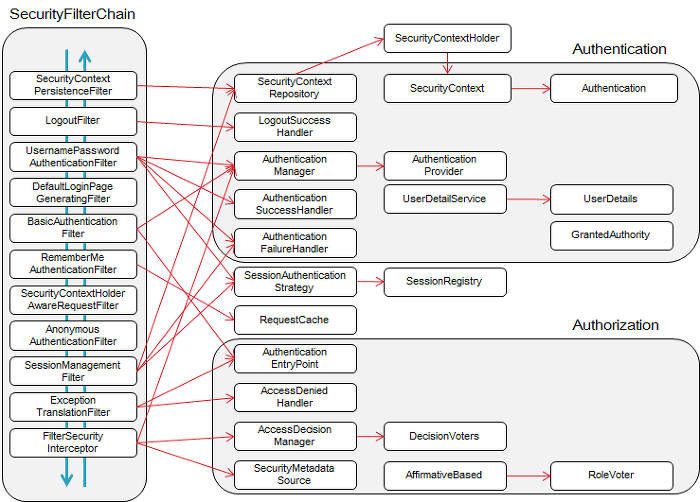

[//]: # (https://gist.github.com/ihoneymon/652be052a0727ad59601 마크다운 문법)
## Spring Security
#### 인증, 권한 부여 및 일반적인 공격에 대한 보호를 제공하는 프레임워크.

스프링 시큐리티 시작하기 https://docs.spring.io/spring-security/reference/servlet/getting-started.html
   
### 인증과 인가
- 인증 : 해당 사용자가 본인이 맞는지 확인하는 과정
- 인가 : 해당 사용자가 요청하는 자원을 실행할 수 있는 권한이 있는가를 확인하는 과정

기본적으로 인증 철자 이후 인가 절차를 진행한다.
이러한 인증과 인가를 위해 Principal(접근주체)을 아이디로, 
Credential(비밀번호)을 비밀번호로 사용하는 Credential 기반의 인증방식을 사용한다.


'인증'과 '권한'에 대한 부분을필터(Filter) 흐름에 따라 처리한다. 
요청이 들어오면, 인증과 권한을위한 필터들을 통하게 된다. 
유저가 인증을 요청할 때 필터는 인증 메커니즘과 모델을기반으로 한 필터들을 통과한다.

```java
Client (request) → Filter → DispatcherServlet → Interceptor →  Controller
```

Filter는 Dispatcher Servlet으로 가기 전에 적용되므로 가장 먼저 URL 요청을 받지만, (웹 컨테이너에서 관리)
Interceptor는 Dispatcher와 Controller 사이에 위치한다는 점에서 적용 시기의 차이가 있다.(스프링 컨테이너에서 관리)   

### 실행 순서
1. 사용자가 로그인 정보와 함께 인증 요청을 한다.
2. AuthentcationFilter가 요청을 가로채고, 가로챈 정보를 통해 UsernamePasswordAuthenticationToken의 인증용 객체를 생성한다.
3. AuthenticationManager의 구현체인 ProviderManager에게 생성한 UsernamePasswordToken 객체를 전달한다.
4. AuthenticationManager는 등록된 AuthenticationProvider를 조회하여 인증을 요구한다.
5. 실제 DB에서 사용자 인증정보를 가져오는 UserDetailsService에 사용자 정보를 넘겨준다.
6. 넘겨받은 사용자 정보를 통해 DB에서 찾은 사용자 정보인 UserDetails 객체를 만든다.
7. AuthenticationProvider는 UserDetails를 넘겨받고 사용자 정보를 비교한다.
8. 인증이 완료되면 권한 등의 사용자 정보를담은 Authentication 객체를 반환한다.
9. 다시 최초의 AuthenticationFilter에 Authentication 객체가 반환된다.
10. Authentication 객체는 SecurityContext에 저장된다.

### Security Filter Chain
   

- **SecurityContextPersistenceFilter** : 
요청(request)전에 SecurityContextRepository에서 받아온 정보를 SecurityContextHolder에 주입합니다.

- **LogoutFilter** : 주체(Principal)의 로그아웃을 진행합니다. 주체는 보통 유저를 말합니다.

- **UsernamePasswordAuthenticationFilter** : 
(로그인) 인증 과정을 진행합니다.

- **DefaultLoginPageGeneratingFilter** :
사용자가 별도의 로그인 페이지를 구현하지 않은 경우, 스프링에서 기본적으로 설정한 로그인 페이지를 처리합니다.

- **BasicAuthenticationFilter** : 
HTTP 요청의 (BASIC)인증 헤더를 처리하여 결과를 SecurityContextHolder에 저장합니다.

- **RememberMeAuthenticationFilter** : 
SecurityContext에 인증객체가 있는지 확인하고 RememberMeServices를 구현한 객체의 요청이 있을 경우, 
Remember-Me( ex)사용자가 바로 로그인을 하기 위해서 저장한 아이디와 패스워드 )를 인증 토큰으로 컨텍스트에 주입합니다.

- **AnonymousAuthenticationFilter** : 
SecurityContextHolder에 인증(Authentication) 객체가 있는지 확인하고, 
필요한 경우 익명 사용자로 Authentication 객체를 주입합니다.(Authentication이 null인 것을 방지)

- **SessionManagementFilter** : 
요청이 시작된 이후 인증된 사용자인지 확인하고, 
인증된 사용자일 경우 SessionAuthenticationStrategy를 호출하여 세션 고정 보호 메커니즘을 활성화하거나
여러 동시 로그인을 확인하는 것과 같은 세션 관련 활동을 수행합니다.

- **ExceptionTranslationFilter** : 
필터 체인 내에서 발생(Throw)되는 모든 예외(AccessDeniedException, AuthenticationException)를 처리합니다.

- **FilterSecurityIntercepter** : 
HTTP 리소스의 보안 처리를 수행한다. 사용자가 요청한 request에 들어가고 결과를 리턴해도 되는 권한(Authorization)이 있는 지 검사한다.
해당 필터에서 권한이 없다는 결과가 나온다면 위의 ExceptionTranslationFilter 필터에서 Exception을 처리해줍니다.

> #### @EnableWebSecurity annotation
> 다른 것들 중에 이것을 기본 Filter Chain으로 설정한다. (@Bean으로 등록해줌)
모든 요청에 대해 이 필터를 적용함.

> #### 인증 이벤트(DefaultAuthenticationEventPublisher)
>성공하거나 실패하는 각 인증에 대해 각가 AuthenticationSuccessEvent 또는 authenticationFailureEvent가 실행된다.
이러한 이벤트를 AuthenticationEventPublisher가 수신하는데 DefaultAuthenticationEventPublisher를 반환한다.
```java
@Bean
public AuthenticationEventPublisher authenticationEventPublisher
        (ApplicationEventPublisher applicationEventPublisher) {
    return new DefaultAuthenticationEventPublisher(applicationEventPublisher);
}
```
 

> #### Authorize HttpServletRequests
> 엔드포인트별 권한 설정 (아래 코드 참고)
```java
http
    .authorizeHttpRequests((authorizeRequests) ->
    authorizeRequests.requestMatchers("/", "login/**").permitAll()
        .requestMatchers("/api1").hasRole("user")
        .requestMatchers("/api2").hasRole("admin")
        .requestMatchers("/user/**").hasRole("user")
        .anyRequest().authenticated())
``` 
1. AuthorizationFilter는 SecuritycontextHolder로부터 Authentication을 가져옴
2. AuthorizationManager가 권한이 있는지 확인
3. 권한이 없다면 AuthorizationDeniedEvent가 실행되고 AccessDeniedException이 던져진다.
4. 만약 권한이 있다면, 피터 체인을 계속 따라간다.

보통 AuthorizationFilter는 default로 가장 마지막에 실행된다.

> #### UserDetailsService
> UserDetailService는 DaoAuthenticationProvider에 의해 사용된다.
 
> #### 내가 만든 로그인 흐름
> -> MemberController에서 signIn() 메서드를 호출    
> -> MemberService에서 UsernamePasswordAuthenticationToken을 만들고 로그인 정보를 담아 AuthenticationManager에게 넘겨준다.   
> -> AuthenticationManager는 UserDetailsService의 loadUserByUsername()을 실행시키고 유저 정보를 담은 UserDetails를 반환한다.   
> -> DaoAuthenticationProvider에서 찾아온 UserDetails의 값과 UsernamePasswordAuthenticationToken의 값을 비교하여 옳은 입력인지 확인   
> -> 유효한 유저이면 serviceImpl에 Authentication 객체를 반환한다.


### Logout과 RefreshToken
이와 같은 JWT 방식은 단 한번도 데이터베이스에 저장한다거나, 조회한다거나 하는 과정이 포함되지 않는다. 
이러한 방식을 stateless하다고 볼 수 있다. 
하지만 이렇게 데이터 stateless한 jwt 방식은 안전한 로그아웃을 구현하기 어렵다. 
서버는 토큰을 발급하면 그 뒤로는토큰에 대한 제어를 완전히 읽는다. 
어딘가에 내가 발급한 토큰도, 어떤 클라이언테에 트큰을 발급했다는정보도 저장해두지 않기 때문이다. 

데이터베이스를 사용하지 않는 jwt의 로그아웃 클라이언트 측에서 쿠키나 로컬 스토리지에서 
jwt토큰을 삭제하거나 무효화하는 방식으로 구현할 수 있다.
하지만, 이 경우 악성 해커가 토큰을 탈취해서 사용한다면, 서버는 토큰반료 시간까지는 더이상 손쓸 방법이 없다.
(refresh 토큰 탈취당하면 진짜 답없음)
따라서, 데이터베이스를 전혀 사용하지 않는 방식으로는 jwt 안전한 로그아웃을 구현할 수 없다.

> #### 해결 방법
> 로그아웃 시 블랙리스트에 **Refresh Token**을 저장한다. 토큰이 탈취당해도 피해를 최소화할 수 있도록 만료 기간을 매우 짧게 설정한다.
블랙리스트는 쉽게 말해 만료되거나 무효화(로그아웃)된 토큰을 저장하는 테이블이다.
이 방법을 사용할 경우 프로느엔드 코드에서 직접 Access Token을 삭제해주면 된다.
Access Token이 만료되어 Refresh Token으로 새로운 Access Token을 요청하는 경우에도, 
서버는 블랙리스트에 Refresh Token이 저장되어 있는 것을 확인하고 Access Token 재발급을 거절할 수 있다.
로그아웃 시에 Access Token도 저장한다. 탈취 당했을 때, 사용할 수 없도록 만든다.
> 
> 하지만,,,, 이 경우 Session을 사용하는 것과 별 다를바가 없다.
> refresh Token만 저장하는것으로 하자
> 
> 로그인 성공 시  
> * 세션방식 : 여전히 세션 db에 접근해 유저 정보를 저장하고 세션 id를 반환 받아야 한다.
> * jwt 방식 : db에 접근할 필요없이 토큰만 발급하면 된다.  
> 
> 로그인 되어 있는 경우
> * 세션 방식 : 늘 세션 id가 유효한지 db를 조회해야 한다.
> * jwt 방식 : db에 별도로 조회할 필요 없이, 서명만 확인해서 토큰이 조작되지 않았는지만 확인하면 된다.
> 
> 로그아웃 시
> * 세션 방식 : 세션 db에서 해당 세션 id에 해당하는 레코드를 삭제해야 한다.
> * jwt 방식 : db의 블랙리스트 테이블에 로그아웃한 계정의 Refresh Token을 저장하면 된다.

참고 https://engineerinsight.tistory.com/232

### jwt 인증과정


- 사용자 로그인시 유효한 회원인지 확인
- 사용자 정보와 권한이 들어가 있는 Access 토큰과 Refresh 토큰 발급 (이때 Refresh 토큰은 DB에 저장한다.)
클라이언트는 두 종류의 토큰을 받는다.
- 이후 사용자가 데이터를 요청할 때마다 Access 토큰을 동봉하여 보낸다.
- 서버는 사용자로부터 전달된 Access 토큰이 유효한지만 판단한다(어자피 사용자의 권한과 정보는 토큰에 자체적으로 있다.)
- Access 토큰이 유효하면 사용자의 요청을 처리해서 반환해준다.
- 사용자는 만료된 Access 토큰으로 데이터 요청을 보냈다고 가정해보자.
- 서버에서는 토큰에 대한 유효성 검사를 통해 만료된 토큰임을 확인한다.
- 클라이언트에게 "너의 토큰은 만료되었으니 갱신하기위해 Refresh 토큰을 보내라" 라고 응답한다.
- 클라이언트는 Access 토큰 재발급을 위해 Access 토큰과 Refresh 토큰을 전송한다.
- 전달받은 Refresh 토큰이 그 자체로 유효한지 확인하고, 3번에서 DB에 저장해 두었던 원본 Refresh 토큰과도 비교하여 같은지 확인한다.
- 유효한 Refresh 토큰이면 Access 토큰을 재발급 해준다.
- 만약 Refresh 토큰도 만료됐다면 로그인을 다시하고 Access 토큰과 Refresh 토큰을 새로 발급해준다.

출처: https://llshl.tistory.com/32 [프로찍먹러:티스토리]

### Cookie/Session 이용방식과 jwt 인증방식 정리
https://velog.io/@kingth/%EC%84%9C%EB%B2%84-%EC%9D%B8%EC%A6%9D-%EB%B0%A9%EC%8B%9D%EC%84%B8%EC%85%98%EC%BF%A0%ED%82%A4-%ED%86%A0%ED%81%B0

--------

### Redis
Redis는 오픈소스로서 NoSQL로 분류되기도 하고, Memcashed와 같은 인메모리 솔루션으로 분류되기도 한다.  
성능은 Memcached의 성능을 낼 수 있으며 다양한 데이터 구조체를 지원한다.  
db, cache, shared memory 등의 용도로 사용되어 진다.
   
### Redis의 성능이 좋은 이유
1. 디스크에 처리하는 것이 아닌 메모리에서 데이터를 처리하기 때문
2. Key-Value 방식의 뱁 형태로 저장되어 별도의 쿼리 없이 값을가져올 수 있기 때문.

### Memcached란?
무료로 사용할 수 있는 오픈소스이며 분산 메모리 캐싱 시스템이다.
데이터 베이스의 부하를 줄여 웹 어플리케이션의 성능을 개선시키기 위해서 사용된다.
DB나 API호출로부터 받아오는 결과 데이터를 작은 단위의 Key-Value형태로 메로리에 저장하는 방식이다.


그림 1은 Memcached를 사용하지 않을 때 웹 서버를 각각 운영하는 상황이다.
두 서버가 독립적으로 운영되기 때문에 각 서버는 할당된 Cache 용량 만큼만 사용할 수 있다.
그림 2는 Memcached를 사용할 때 웹 서버를 각각 운영하는 상황이다.
물리적으로 별도의 Cache를 로직상 하나의 Cache로 사용할 수 있게 해준다.
즉, 논리적으로는 Cache가 결합되어 있기 때문에 각 웹서버는 전체 메모리 캐시 용량 만큼 사용할 수 있다.
한 서버가 자신에게 할당된 Cache보다 더 많이 사용해야 하는 경우 Cache를많이 사용하지 않은 서버의 Cache영역을 사용할 수 있다.


> 단점
> 1. 인 메모리 기반의 시스템이므로 데이터가 메모리에만 저장되고 휘발성인 특징으로 인해 프로그램 종료 시 데이터가 모두 소멸된다.
> 2. Redis Cache처럼 데이터 타입과 api가 다양하지 않다.
> 
> 장점
> 1. 캐싱처리를 통해 DB/API 통신을 줄일 수 있다.
> 2. Redis는 트래픽이 몰리면 응답속도가 불안정한 반면에 트래픽이 몰려도 memcached의 응답 속도는 안정적인 편이다.
> 3. 객체를 캐시할 수 있다.
    

### Redis 특징
1. 영속성을 지원하는 인 메모리 데이터 방식   
서버가 종료되더라도 디스크에 저장된 데이터를 읽어 메모리에 로딩하게 된다.   
RDB : 특정한 간격마다 메모리에 있는 Redis 데이터 전체를 디스크에 쓰는 것   
AOP : redis의 모든 write/update 연산 자체를 모두 log 파일에 기록하는 형태
2. 다양한 자료구조를 지원
memcached와 달리 key의 자료형으로 다양한 구조체를 지원한다.
3. 싱글 스레드 방식으로 인해 연산을 원자적으로 수행
Redis는 싱글 스레드방식을 사용하기 때문에 연산을 원자적으로 처리하여 Race Conditions이 거의 발생하지 않는다.

> Race Condition이란?
> 두개 이상의 프로세스가 공유자원을 병행적으로 읽거나 쓸는 동작을 할 때 
> 공유 자원에 대한 접근이 어떤 순서로 이뤄졌는지에 따라 동일한 결과가 나오지 않는 상황.
> 즉, 실행결과가 같지 않은 상황

싱글 스레드 방식을 사용하기 때문에 하나의 트랜잭션은 하나의 명령어만 실행할 수 있으므로 Race Condition을 막을 수 있다.

### Redis를 써보자
```java
# build.gradle
implementation 'org.springframework.boot:spring-boot-starter-data-redis

# Redis Cache
spring:
data:
redis:
host: localhost
port: 6379

config
@Configuration
public class RedisConfig {

    @Value("${spring.data.redis.host}")
    private String host;

    @Value("${spring.data.redis.port}")
    private int port;

    @Bean
    public RedisConnectionFactory redisConnectionFactory() {
        return new LettuceConnectionFactory(host, port);
    }

    /*
     * Redis Cache를 사용하는 방법으로는 크게 RedisRepository와 RedisTemplate이 있다.
     * 그중 이번에 사용할 RedisTmplate은 특정 Entity뿐만 아니라 원하는 여러가지 타입(자료형)을 넣을 수 있다.
     * RedisTemplate를 선언한 후 원하는 key, Value 타입에 맞게 Operations(String, Hash, Set 등)를 선언하여 사용할 수 있다는 장점이 있다.
     * 아래와 같이 제네릭을 <?, ?>으로 선언하여 RedisTemplate을 주입받을 때 원하는 key, value 타입을 지정하여 주입받을 수 있게 한다.
     * https://velog.io/@rnqhstlr2297/Spring-boot%EC%97%90%EC%84%9C-Redis-%EC%82%AC%EC%9A%A9%EB%B2%95
     * */
    @Bean
    public RedisTemplate<?, ?> redisTemplate() {
        RedisTemplate<?, ?> redisTemplate = new RedisTemplate<>();
        redisTemplate.setConnectionFactory(redisConnectionFactory());
        return redisTemplate;
    }
}
```

redis window 다운 https://github.com/microsoftarchive/redis/releases   
msi 파일을 다운받는다.

#### test
```java
package com.example.demo.config;

import org.assertj.core.api.Assertions;
import org.junit.jupiter.api.Test;
import org.springframework.beans.factory.annotation.Autowired;
import org.springframework.boot.test.context.SpringBootTest;
import org.springframework.data.redis.core.RedisTemplate;
import org.springframework.data.redis.core.ValueOperations;

@SpringBootTest
class RedisConfigTest {

    @Autowired
    private RedisTemplate<String, String> redisTemplate;

    @Test
    public void testStrings() throws Exception {

        //given
        ValueOperations<String, String> valueOperations = redisTemplate.opsForValue();
        String key = "accessToken";

        //when
        valueOperations.set(key, "test");

        //then
        String value = valueOperations.get(key);
        Assertions.assertThat(value).isEqualTo("test");
    }
}
```
redis-cli 들어가서 keys *를 쳐보면 accessToken이 들어있는 것을 확인할 수 있다.   

참고 : https://velog.io/@rnqhstlr2297/Redis-JWT%EB%A5%BC-%EC%9D%B4%EC%9A%A9%ED%95%9C-%EB%A1%9C%EA%B7%B8%EC%95%84%EC%9B%83-%EA%B5%AC%ED%98%84